| fig1.1.1 subsample scatter | fig1.1.2 Frogs scatter |
| :------------------------: | :--------------------: |
|     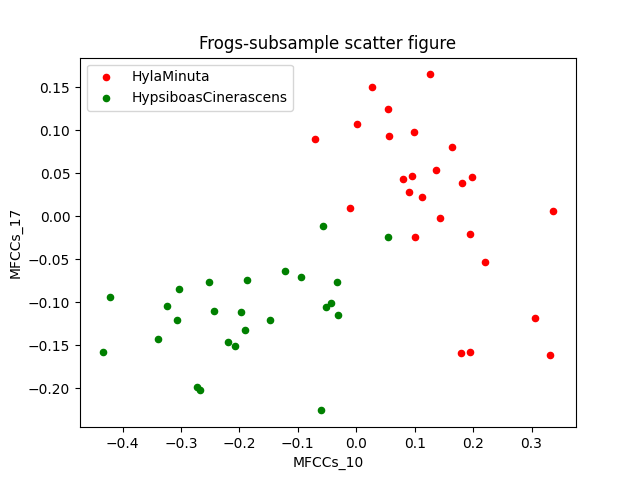     |  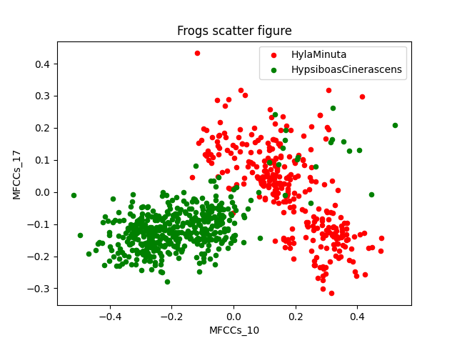   |

| fig 1.2.1 subsample histogram for MFCC_10 | fig 1.2.2  subsample histogram for MFCC_17 |
| :---------------------------------------: | :----------------------------------------: |
|            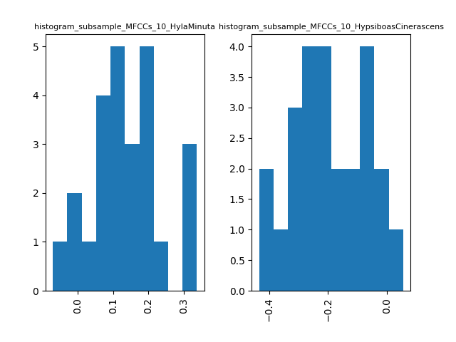             |             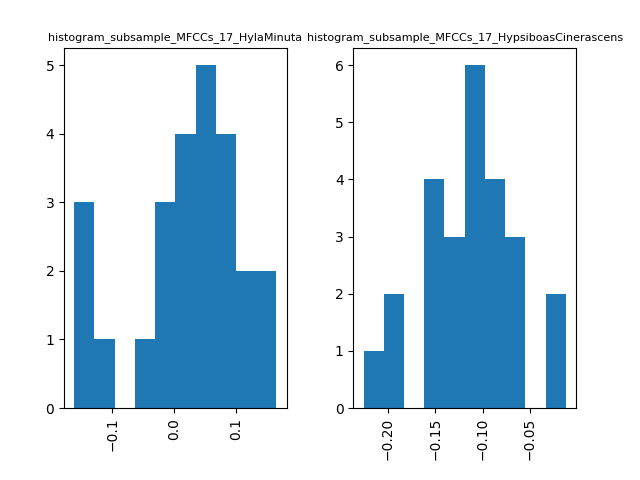             |

| fig 1.2.3 Frog histogram for MFCC_10 | fig 1.2.4 frogs histogram for MFCC_17 |
| :----------------------------------: | :-----------------------------------: |
|          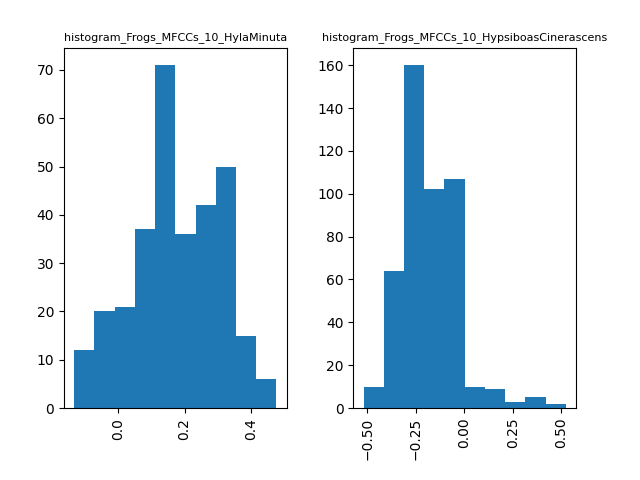          |          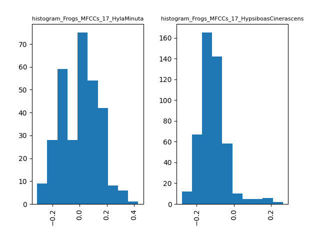           |

| fig 1.3.1 subsample line graph for HylaMinuta MFCC_10 | fig 1.3.2 subsample line graph for HylaMinuta MFCC_17 |
| :---------------------------------------------------: | :---------------------------------------------------: |
|                   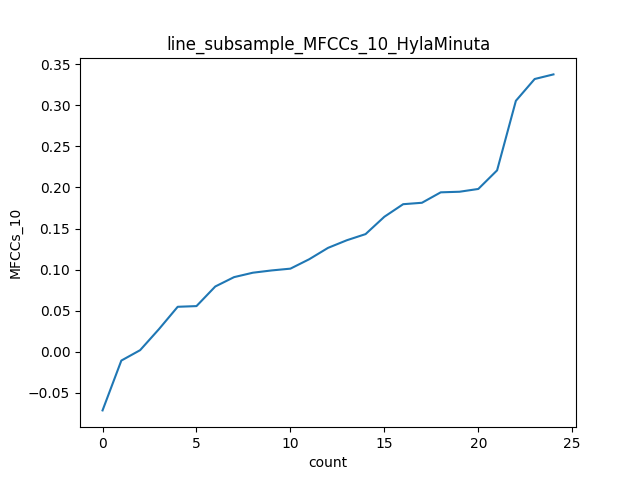                   |                   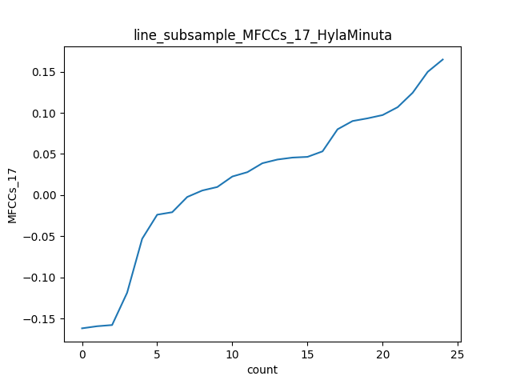                   |

| fig 1.3.3 subsample line graph for HypsiboasCinerascens MFCC_10 | fig 1.3.4 subsample line graph for HypsiboasCinerascens MFCC_17 |
| :----------------------------------------------------------: | :----------------------------------------------------------: |
|                      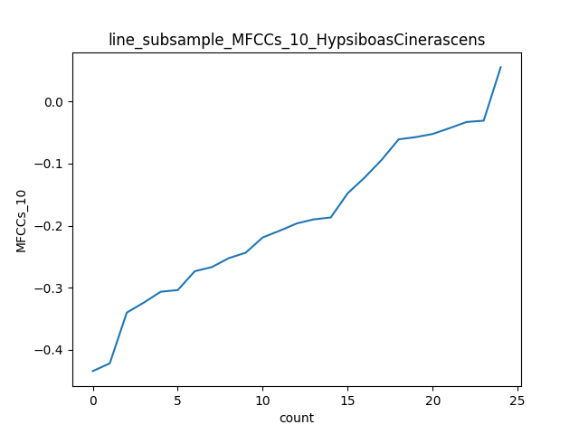                       |                      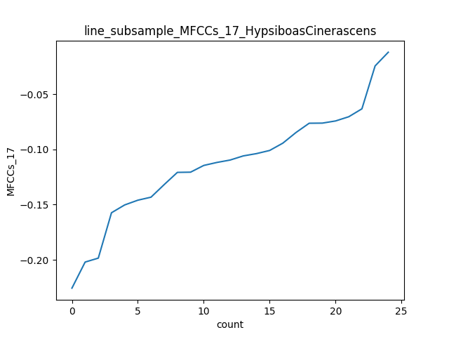                       |

| fig 1.3.5 Frogs line graph for HylaMinuta MFCC_10 | fig 1.3.6 Frogs line graph for HylaMinuta MFCC_17 |
| :-----------------------------------------------: | :-----------------------------------------------: |
|                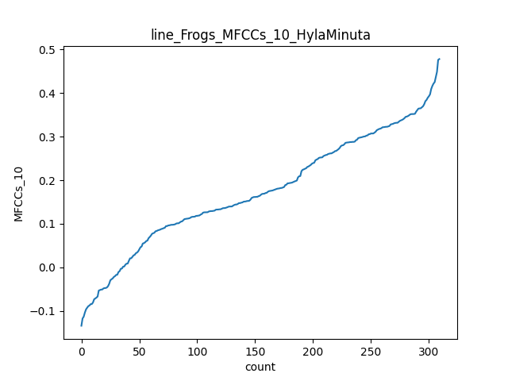                 |                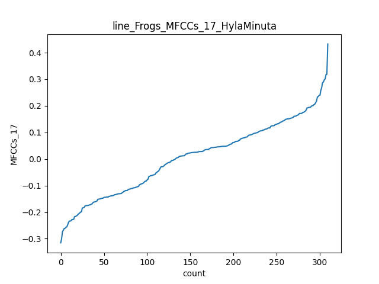                 |

| fig 1.3.7 Frogs line graph for HypsiboasCinerascens MFCC_10 | fig 1.3.8 Frogs line graph for HypsiboasCinerascens MFCC_17 |
| :---------------------------------------------------------: | :---------------------------------------------------------: |
|                     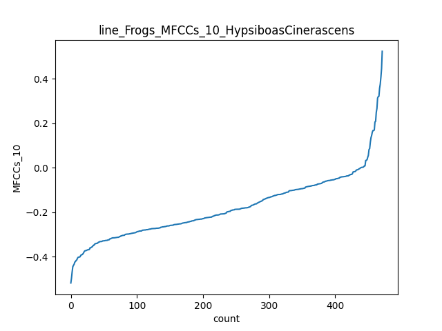                      |                     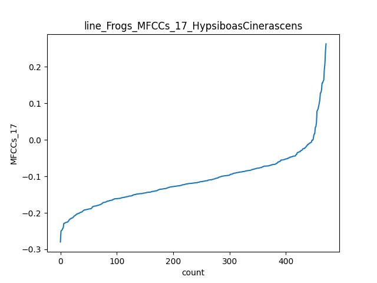                      |

| fig 1.4.1 subsample boxplot | fig 1.4.2 Frogs boxplot |
| :-------------------------: | :---------------------: |
|      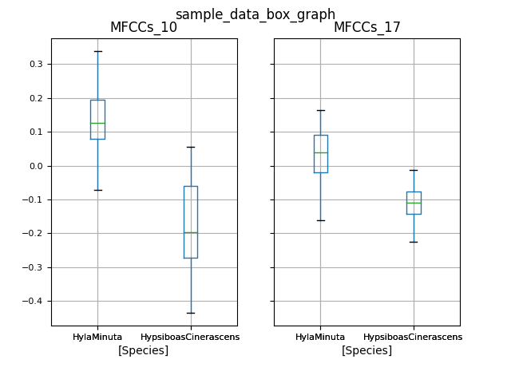      |   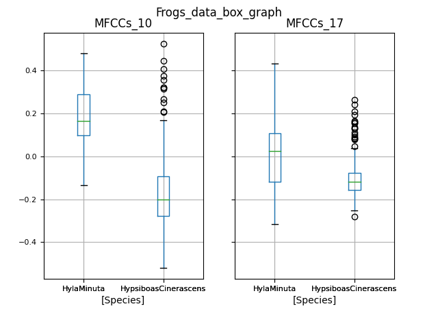    |

| fig 1.4.1 subsample Bar graph with error bars | fig 1.4.2 Frogs Bar graph with error bars |
| :-------------------------------------------: | :---------------------------------------: |
|              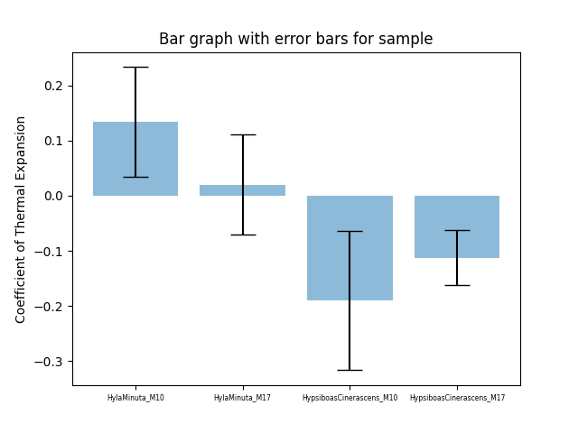               |            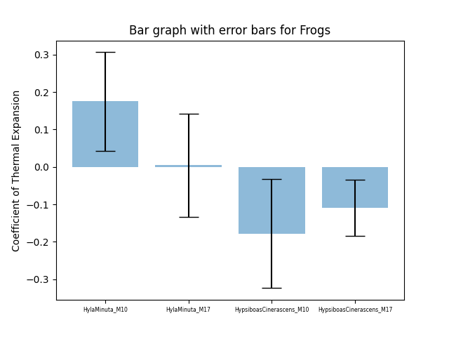             |

|        | MFCCs_10_mean         | MFCCs_17_mean         | MFCCs_10_cov | MFCCs_17_cov | MFCCs_10_std        | MFCCs_17_std        |
| ------ | --------------------- | --------------------- | ------------ | ------------ | ------------------- | ------------------- |
| sample | -0.02801130178        | -0.046330259160000005 | [0.04005957] | [0.00995278] | 0.19813728038317813 | 0.09876093885552142 |
| Frogs  | -0.038321155240409216 | -0.06451480131585678  | [0.0496062]  | [0.0140389]  | 0.2225820435148893  | 0.11841006605870075 |

| fig 1.5.1 logistic decision boundary for subsample | fig 1.5.2 logistic decision boundary for Frogs |
| :------------------------------------------------: | :--------------------------------------------: |
|                    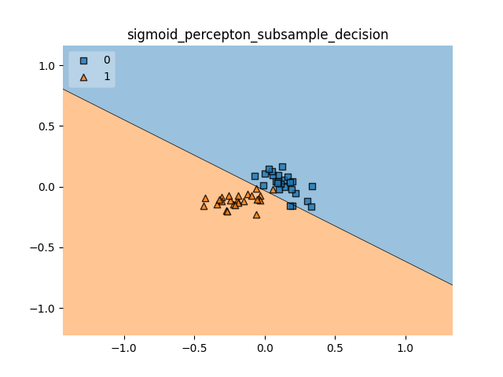                    |                  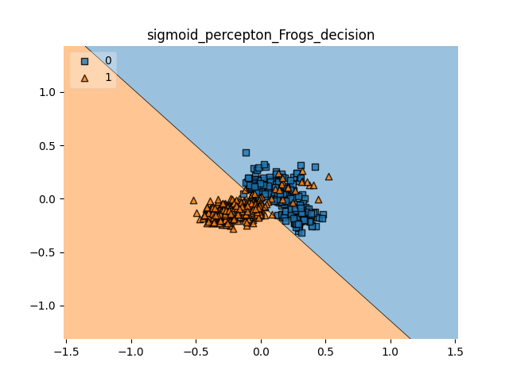                  |

| fig 1.6 neural network decision boundary for Hastie-data |
| :------------------------------------------------------: |
|                       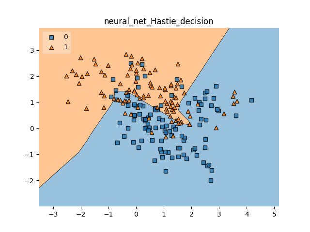                        |

Q1:

for the scatter figure, fig1.1.1 has much less merge between the two classes, but fig 1.1.2 has many green dots split in the red region. However, both fig1.1.1 and fig1.1.2 have a similar region for both classes.

For the line graph, different classes have totally different shapes and ranges.(compare all the 1.31-1.33,1.32-1.34,1.35-1.37,1.36-1.38). Different datasets have a similar range but the big sample are more smooth curve but the subsample is steep(compare 1.31-1.35,1.32-1.36,1.33-1.37,1.34-1.38)

In the boxplot, different samples have similar boxes and positions. But the fig 1.42 indicates that HypsiboasCinerascens have many unusual samples compared to both the small sample and another class.

In the subsample Bar graph with error bars in fig 1.41 and fig 1.42, both samples have similar shapes, but different ranges. For different classes, the shape and range are totally different.

Q2:

 I think both decision boundaries fig 1.5.1 and 1.5.2 divide the data well. Because the test case is the same as training data and the two classes don't have many merge areas. So both boundary is good.  

Also, the subsample needs much more epochs to get a good boundary, I think because a small sample will contribute less weight in each epoch.

Q3:

1. I use 100 relu perceptions in the first layer and 1 sigmoid perception in the final layer. I design this because the training data is small so 100 perceptions will not cause a computational issue. And different active functions will give a better curve in my experience. Also, the perceptions at each layer: the result significantly improved when the perceptions increased in the beginning. I think because each perception can only perform well in some subsets of the dataset. So having enough nodes can take care of more edge cases.

1. Compare to 2.1 Linear regression, the neural network has a curve to cover much more cases in the boundary. The 2.2 15-Nearest Neighbor classifier has a similar and even better effect in the 2 dimension data compare to my boundary. The 2.3 1- Nearest classifier can divide all the data well but I think it will regrade when the test data is different from the training data. 
2. Maybe some noise removal technique to remove some noise in advance. So the boundary line will be more proper.
3. Also, the small clusters can't be detected like the triangle dots in fig 1.6 right region. So we can use some cluster-based algorithms to improve the boundary

 Finally, we can use confidence to make a better presentation of the boundary of probability near the boundary.

